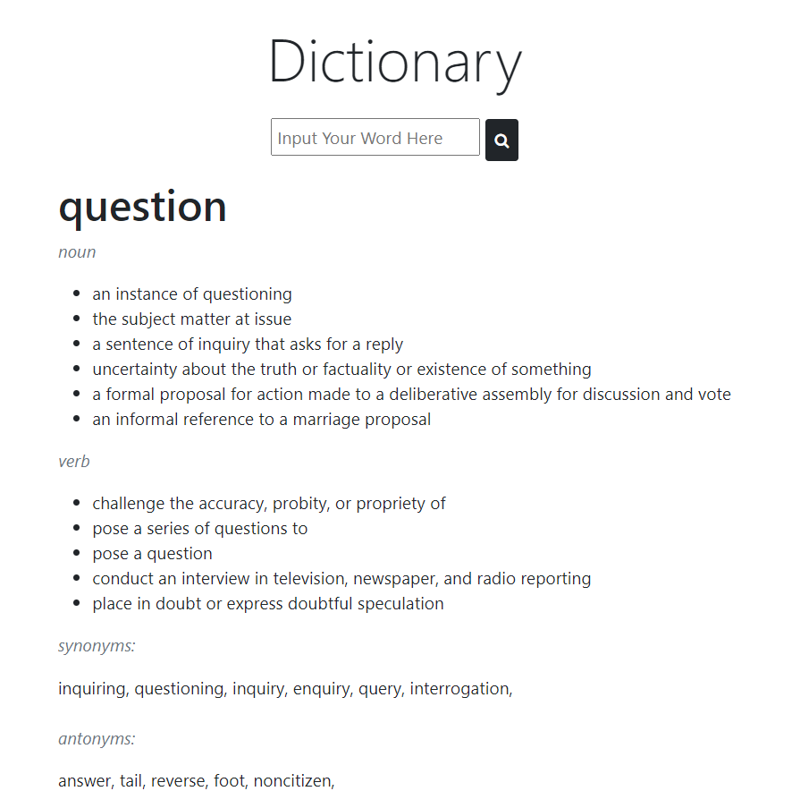

# Django English Dictionary

An English Dictionary using Django framework



## Installation & Usage

Clone the project on your machine and run the virtual environment (I use pipenv, please install this package if you don't have).

```bash
pipenv shell
```

The dictionary is power by PyDictionary. If somehow the environment doesn't include it, install it:

```bash
pipenv install PyDictionary
```

Finally, run the command:

```bash
python manage.py runserver
```

You can open http://localhost:8000 to view the page.

## Problems and Future update

Maybe use an API instead of Python library, since the functionalities are limited

Try and develop similar app for Vietnamese and Chinese

## Contributing
Pull requests are welcome. For major changes, please open an issue first to discuss what you would like to change.

Please make sure to update tests as appropriate.
